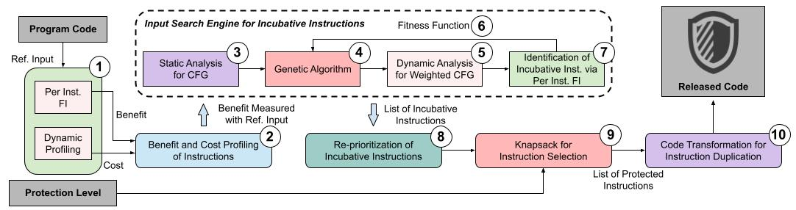

# Multi-Input-Hardened SID (MINPSID)

## Contents
1. [Introduction](#introduction)
2. [Environment Configuration](#environment-configuration)
3. [Benchmark Info](#benchmark-info)
3. [Running MINPSID](#minpsid)
4. [Reproducing Paper Results](#reproducing-paper-results)
5. [Contributor](#contributor)
6. [Citation](#citation)

## Introduction
With the ever-shrinking size of transistors, silent data corruptions (SDCs) are becoming a common issue in high-performance computing (HPC).
Selective instruction duplication (SID) is a widely used fault-tolerance technique that can obtain high SDC coverage with low performance overhead. 
However, existing SID methods are confined to single program input in its assessment, assuming that error resilience of a program remains similar across inputs.
Nevertheless, we observe that the assumption cannot always hold, leading to a drastic loss in SDC coverage across different inputs, compromising HPC reliability. 
To this end, we propose
**MINPSID**, an LLVM IR-level SID framework that automatically and flexibly hardens a program against SDC across multiple program inputs. 
To know more about how **MINPSID** works, you may refer to our [SC'22 paper]() and [PPoPP'22 poster paper]().

<p align="center"></p>

## Environment Configuration
> Before configuring the environments, please make sure your CPU supports at least 20 threads (checking by "nproc"), since fault injection experiments are time-consuming and should be accelerated in parallel.

There are two methods to configure environments for MINPSID: one is using the Docker image we prepared, the other one is manually setting up environments on your local Ubuntu 16.04 machine. **We highly recommend you use the Docker image we prepared**, because all the dependencies are already configured on that. Very easy to use :)!

### For those who use Docker (highly recommend!)
To install Docker on your local **Linux** machine, you can follow the steps in this [LINK](https://docs.docker.com/engine/install/ubuntu/). You may also want to use Docker without sudo access (like I did in following commands), please check this [LINK](https://docs.docker.com/engine/install/linux-postinstall/). (ofc you can ignore this if you are expertise in Docker... orz)
```bash
# Download our prepared image from Docker Hub.
docker pull hyfshishen/sc22-minpsid-env

# Execute this image to a running container.
docker run -it hyfshishen/sc22-minpsid-env /bin/bash
```
After you run this image as a running container, change directory to ```/root```, you can found LLFI and other dependencies have already installed! And you are ready to run MINPSID.

### For those who don't use Docker
In this way, you need to configure the dependencies manually. The dependencies are listed as below:
- Ubuntu 16.04
- Python 2.7 and 3.5 (with PyYaml 4.2b4 installed)
- Cmake (minimum v2.8)
- tcsh
- LLFI (LLVM-level Fault Injection Tool)

Among those dependencies, LLFI, which contains LLVM 3.4 and its related software (such as clang), is the key dependency for MINPSID.
The commands for installing LLFI can be checked as below:
```bash
# Download LLFI source code
git clone https://github.com/DependableSystemsLab/LLFI.git

# Quick install LLFI & LLVM 3.4
cd $WHERE_YOU_INSTALL_LLFI$/installer/
python3 InstallLLFI.py --noGUI

# Add LLVM/LLFI executable binary path to local environment
echo "export PATH=$PATH:$WHERE_YOU_INSTALL_LLFI$/installer/llvm/bin/" >> ~/.bashrc
echo "export PATH=$PATH:$WHERE_YOU_INSTALL_LLFI$/installer/llfi/bin/" >> ~/.bashrc
```

## Benchmark Info
> In the following benchmark table:
>- *Name in Paper*: means the benchmark name shown in our SC'22 paper.
>- *Name in Code*: means the benchmark name used in code.

In this repository, you should use *Name in Code* while running the code.

| **Benchmark (Name in Paper)**  | **Benchmark (Name in Code)** | **Suite** | **Program Input** | **No. of Static Instrunctions** | **Benchmark Workload** |
|--|--|--|--|--|--|
| [kNN](https://github.com/JuliaParallel/rodinia/tree/master/openmp/nn)                         | nn                | Rodinia   | filelist.txt 5 30 90             | 349  | small    |
| [Backprop](https://github.com/JuliaParallel/rodinia/tree/master/openmp/backprop)              | backprop          | Rodinia   | 65536                            | 1680 | medium  |
| [BFS](https://github.com/JuliaParallel/rodinia/tree/master/openmp/bfs)                        | bfs               | Rodinia   | graph1M.txt                      | 383  | small    |
| [Kmeans](https://github.com/JuliaParallel/rodinia/tree/master/openmp/kmeans)                  | kmeans            | Rodinia   | -i kdd_cup                       | 1018 | medium  |
| [Needle](https://github.com/JuliaParallel/rodinia/tree/master/openmp/nw)                      | needle            | Rodinia   | 2048 10 2                        | 1069 |  small  |
| [Particlefilter](https://github.com/JuliaParallel/rodinia/tree/master/openmp/particlefilter)  | particlefilter    | Rodinia   | -x 128 -y 128 -z 10 -np 10000    | 1869 | medium  |
| [Pathfinder](https://github.com/JuliaParallel/rodinia/tree/master/openmp/pathfinder)          | pathfinder        | Rodinia   | 1000 10                          | 372  | small    |
| [LUD](https://github.com/JuliaParallel/rodinia/tree/master/openmp/lud)                        | lu                | Rodinia   | -v -s 256                        | 1161 | medium  |
| [FFT](https://github.com/staceyson/splash2/tree/master/codes/kernels/fft)                     | fft               | SPLASH-2  | -m10 -p1 -n65536 -l4 -t          | 2138 | small    |
| [HPCCG](https://github.com/Mantevo/HPCCG)                                                     | hpccg             | Mantevo   | 64 64 64                         | 1975 | large    |
| [Xsbench](https://github.com/ANL-CESAR/XSBench/tree/master/openmp-threading)                  | xsbench           | CESAR     | -t 1 -s small -g 512 -l 1500     | 2366 | large    |

## MINPSID
> This section is to execute MINPSID on above benchmarks.

After changing directory to MINPSID-launcher by executing ```cd MINPSID-launcher```, There are three steps to generate MINPSID protection on selected benchmarks. We here use Pathfinder from Rodinia as example:

1. Fuzzing for finding incubative instructions (IIS). This step contains masssive fault-injection experiments and may take you some time. Please press **ENTER** after the FI results are finished (if you wait for like 10 minutes and nothing new is printed on the screen, and that means finished).
    ```bash
    python3 01-fuzzing-finding-IIS.py pathfinder 20
    ```
2. Cost-and-benefit reprioritization and Knapsack selection for generating protection information.
    ```bash
    python3 02-knapsack-selection.py pathfinder 20
    ```
3. Code transformation for selective instruction duplication to protect the selected IR Pathfinder.
    ```bash
    python3 03-SID-code-transformation.py pathfinder 20
    ```
Then, the protected IR can be checked by the results printed on the screen.

## Reproducing Paper Results
> This section is for SC'22 AD/AE review steps.

We provide step by step commands for running MINPSID and result-generation scripts.
There are three key evaluations in this paper:
- **Figure 2 in Section III**: This is showing why existing SID method cannot garantee protection across multiple input in each benchmark.
- **Figure 6 in Section VI**: This is showing how MINPSID outperforms existing SID method across multiple input in each benchmark.
- **Figure 9 in Section VII**: This is showing that MINPSID can also achieve promising result in real-world input scenarios.

The time-cost is different across different benchmarks, which can be found in Table above. Besides, please use *Name in Code* (also shown in above Table) to execute each benchmark. Before you start, please download the MINPSID code by following commands:
```bash
git clone https://github.com/hyfshishen/MINPSID.git
```

### Section III - Preliminary Study
Results in this section refers to Figure 2 in paper.
1. Change directory to the folder related to Section III.
    ```bash
    cd AD-AE-evaluation/s3-preliminary
    ```
2. Execute scripts for running and results colelction. This step contains massive fault-injection experiments and may take you some time. After that the results will be printed automatically.
    ```bash
    python3 run.py BENCHMARK-NAME-IN-CODE 20
    # e.g.:
    #   python3 run.py pathfinder 20
    #   python3 run.py nn 20
    #   python3 run.py needle 20
    #   python3 run.py lu 20
    #   ......
    ```

### Section VI  - Evaluation
Results in this section refers to Figure 6 in paper. We here use pathfinder as example, other benchmarks are totally the same.
1. Change directory to the folder related to Section VI.
    ```bash
    cd AD-AE-evaluation/s6-evaluation
    ```
2. Fuzzing for finding incubative instructions (IIS). This step contains masssive fault-injection experiments and may take you some time. Please press **ENTER** after the FI results are finished (if you wait for like 10 minutes and nothing new is printed on the screen, and that means finished).
    ```bash
    python3 01-fuzzing-finding-IIS.py pathfinder 20
    ```
3. Cost-and-benefit reprioritization and Knapsack selection for generating protection information.
    ```bash
    python3 02-knapsack-selection.py pathfinder 20
    ```
4. Random fault injection experiments for evaluating the MINPSID. This step contains massive fault-injection experiments and may take you some time. After that the results will be printed automatically.
    ```bash
    python3 03-randomFI-evaluation.py pathfinder 20
    ```
Note that only MINPSID results in Figure 6 will be printed here, the Baseline (i.e. existing SID method) results can be found in Figure 2 (Section III).

### Section VII - Case Study: Real-World Input.
Results in this section refers to Figure 9 in paper. We here use bfs as example, the execution of kmeans are totally the same.
1. Change directory to the folder related to Section VI.
    ```bash
    cd AD-AE-evaluation/s7-case-study-real-world
    ```
2. Fuzzing for finding incubative instructions (IIS). This step contains masssive fault-injection experiments and may take you some time. Please press **ENTER** after the FI results are finished (if you wait for like 10 minutes and nothing new is printed on the screen, and that means finished).
    ```bash
    python3 01-fuzzing-finding-IIS.py bfs 20
    ```
3. Cost-and-benefit reprioritization and Knapsack selection for generating protection information.
    ```bash
    python3 02-knapsack-selection.py bfs 20
    ```
4. Random fault injection experiments for evaluating the MINPSID. This step contains massive fault-injection experiments and may take you some time. After that the results will be printed automatically.
    ```bash
    python3 03-randomFI-evaluation.py bfs 20
    ```

## Contributor
[Yafan Huang](https://hyfshishen.github.io/) from the University of Iowa.

## Citation
To-do.
